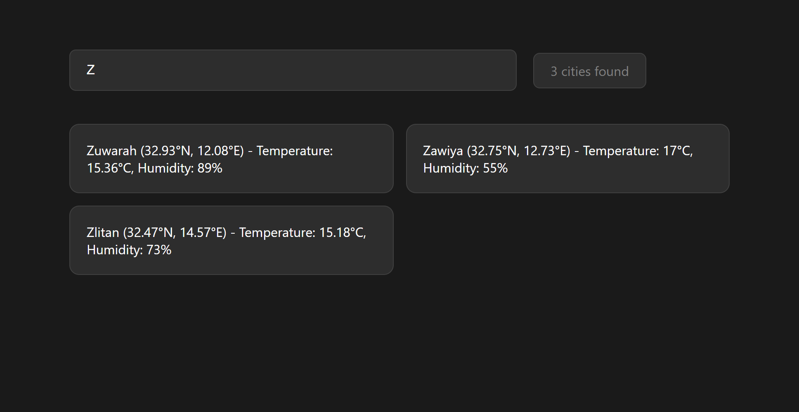

# Weather City Search Application



## Overview
This application demonstrates a real-time city search interface that displays weather information from the OpenWeatherMap API. It includes a local proxy server solution to handle CORS (Cross-Origin Resource Sharing) issues that commonly arise in development environments.

## Why a Proxy Server?
The application uses a proxy server for several important reasons:

1. **CORS Handling**: The OpenWeatherMap sample API doesn't include the necessary CORS headers that would allow direct browser requests. Our proxy server adds these headers, making the API accessible from the frontend.

2. **Security**: The proxy server helps keep API keys and sensitive information server-side rather than exposing them in the frontend code.

3. **Request Control**: The proxy allows us to modify, validate, or transform requests and responses as needed.

## Project Structure
```
├── package.json        # Project dependencies and scripts
├── server.js          # Proxy server implementation
└── src/
    ├── index.html     # Main HTML file
    ├── script.js      # Frontend JavaScript
    └── style.css      # Styling
```

## How It Works

### Server (server.js)
- Uses Express.js to create a lightweight server
- Implements CORS middleware to handle cross-origin requests
- Serves static files from the `src` directory
- Provides a `/weather` endpoint that proxies requests to OpenWeatherMap API

### Frontend (src/)
- Implements real-time search functionality
- Displays city weather information including:
  - City name
  - Coordinates (latitude and longitude)
  - Temperature
  - Humidity

## Setup and Running

1. Install dependencies:
```powershell
npm install
```

2. Start the server:
```powershell
npm start
```

3. Access the application:
- Open http://localhost:3000 in your browser
- The application will load and connect to the proxy server automatically

## Data Flow
1. Browser makes request to `http://localhost:3000`
2. Server serves static files from `src/` directory
3. Frontend JavaScript makes request to `http://localhost:3000/weather`
4. Proxy server forwards request to OpenWeatherMap API
5. Weather data is returned to frontend and displayed in the interface

## Features
- Real-time search filtering
- Case-insensitive search
- Displays comprehensive weather information
- Fallback to sample data if API fails
- Automatic display of all cities on initial load

## Technical Implementation
- Uses native Fetch API for HTTP requests
- Implements async/await for clean asynchronous code
- Includes error handling for API failures
- Uses Express.js for efficient server routing
- Implements CORS middleware for cross-origin request handling
